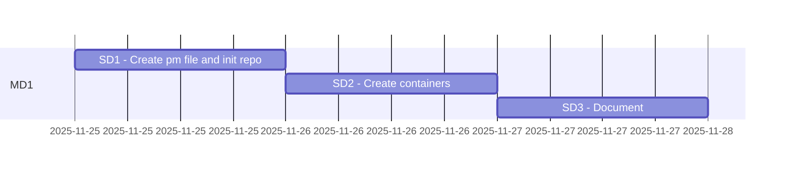

# Java containers

Abbreviations
> * PM Product Milestone
> * MD Milestone division
> * SD Subdivision

## Analyzing all parts

|#|Part|Details|Total Duration|Status|
|:-|:-|:-|:-|:-|
|1|[Part 1](%base_url%/pm#Part_1_timeplan)|2025-11-25 - |- hours|ONGOING|
|:-|:-|:-|::||

## Part 1 timeplan

# Card template
> ## `<week-number>-<card-number>`
> ### Goal : <card-title/commit message>
> Explain final goal for this card
> 
> ### DOD  (definition of done):
> What will happen after finishing this card
> 
> ### TODO :
> - [] 1.
> 
> ### Reports :
> * 
> 
> ### Steps to test and debugging:
> - [] 1.
> 
> ### References :
> * 

# Stories/cards MD1

## 48-001

### Goal : Create pm files and inir repo
The goal of this card is to create a deck file to manage job.
It also aims to create a new repo on github and update git hooks.

### DOD  (definition of done):
A new repo named `containers` is created.
A `DECK.MD` with needed stories added to the created repo

### TODO :
- [] 1. Create a repo name `containers`
- [] 2. Add a deck file
- [] 3. Update Deck with needed stories

### Reports :
* 

#### Steps to test and debugging:
- [] 1.

#### References :
* 
