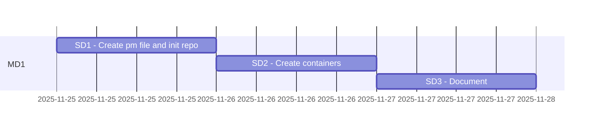

# Java containers

Abbreviations
> * PM Product Milestone
> * MD Milestone division
> * SD Subdivision

## Analyzing all parts

|#|Part|Details|Total Duration|Status|
|:-|:-|:-|:-|:-|
|1|[Part 1](%base_url%/pm#Part_1_timeplan)|2025-11-25 - |- hours|ONGOING|
|:-|:-|:-|::||

## Part 1 timeplan

# Stories/cards MD1

## 48-001
### Goal : Create pm files and init repo
The goal of this card is to create a deck file to manage job.
It also aims to create a new repo on github and update git hooks.

### DOD  (definition of done):
A new repo named `containers` is created.
A `DECK.MD` with needed stories added to the created repo

### TODO :
- [x] 1. Create a repo name `containers`
- [x] 2. Add a deck file
- [x] 3. Update Deck with needed stories

### Reports :
* 

#### Steps to test and debugging:
- [] 1.

#### References :
* 
---

## 48-002
### Goal : Create containers
The goal of this card is to created needed containers,

### DOD  (definition of done):
Three containers (openjdk, maven and tomcat) are created.

### TODO :
- [ ] 1. openjdk
- [ ] 2. maven
- [ ] 3. tomcat

### Reports :
* 

#### Steps to test and debugging:
- [] 1.

#### References :
* 
---

## 48-003
### Goal : Document the creted containers
The goal of this card is to add a README.md and documents usages and containers' details.

### DOD  (definition of done):
A README is added to the repo

### TODO :
- [ ] 1. Add readme file

### Reports :
* 

#### Steps to test and debugging:
- [] 1.

#### References :
* 
---